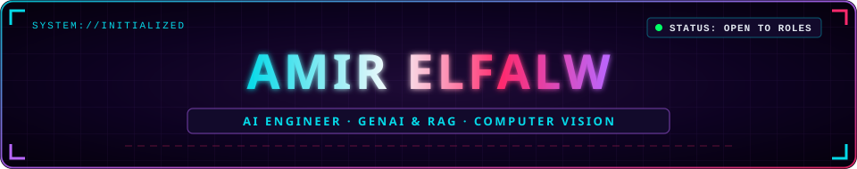
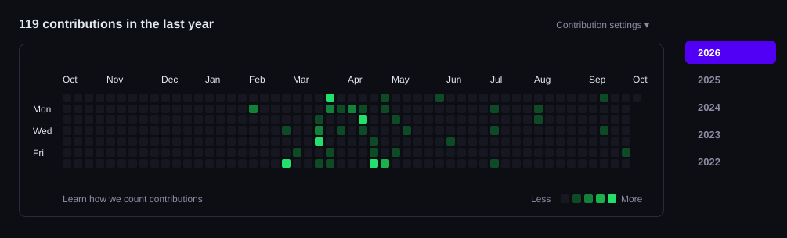

  

  

  
  
  
  
  
  

  

<h2 align="center">// ABOUT</h2>

<table align="center">
  <tr><td><code>ROLE</code></td><td>AI Engineer specializing in GenAI (RAG & Autonomous Agents), Computer Vision, and Full-Stack Integration</td></tr>
  <tr><td><code>STACK</code></td><td>Python, PyTorch, LangChain, LangGraph, FastAPI, Docker, Qdrant, React, PostgreSQL</td></tr>
  <tr><td><code>EDU</code></td><td>Faculty of Computer and Information Sciences, Mansoura University (Class of 2026)</td></tr>
  <tr><td><code>STATUS</code></td><td>Open to AI Engineer / ML Engineer roles</td></tr>
  <tr><td><code>CONTACT</code></td><td><a href="https://www.linkedin.com/in/amir-elfalw-b3a3212b8/">Connect on LinkedIn</a></td></tr>
</table>

<h2 align="center">// TECH_STACK</h2>

  

<h2 align="center">// FEATURED_PROJECTS</h2>

<table align="center">
  <tr>
    <td width="50%" valign="top">
      <b>Multi-Agent E-Commerce Procurement</b> 
      <code>PROBLEM</code> Manual product sourcing across suppliers is slow and inefficient. 
      <code>SOLUTION</code> Autonomous 4-agent CrewAI pipeline with Groq for web search, supplier evaluation, and executive reports. 
      <code>STACK</code> CrewAI · Gemini · Groq · Python 
      <code>LINK</code> <a href="https://github.com/amerelfalwo/search_agent_crew"><b>View Repository ↗</b></a>
    </td>
    <td width="50%" valign="top">
      <b>Guardrailed Healthcare Chatbot</b> 
      <code>PROBLEM</code> Medical conversational agents require strict privacy, PII protection, and medical boundaries. 
      <code>SOLUTION</code> LangChain agent featuring PII redaction, clinical safety guardrails, and human-in-the-loop fallback. 
      <code>STACK</code> LangChain · FastAPI · Docker · Redis 
      <code>LINK</code> <a href="https://github.com/amerelfalwo/Chat-Assistant"><b>View Repository ↗</b></a>
    </td>
  </tr>
  <tr>
    <td width="50%" valign="top">
      <b>Agentic Memory & RAG Assistant</b> 
      <code>PROBLEM</code> Long conversations lose semantic context without persistent memory across sessions. 
      <code>SOLUTION</code> Stateful LangGraph workflow with long-term memory graph, vector search, and dynamic tool calling. 
      <code>STACK</code> LangGraph · LangChain · Qdrant · PostgreSQL 
      <code>LINK</code> <a href="https://github.com/amerelfalwo/agentic_memory"><b>View Repository ↗</b></a>
    </td>
    <td width="50%" valign="top">
      <b>Brain Tumour MRI Detection</b> 
      <code>PROBLEM</code> Manual segmentation of brain lesions in MRI scans is time-critical and labor-intensive. 
      <code>SOLUTION</code> Deep learning segmentation & classification model delivering high accuracy across multi-modal MRI scans. 
      <code>STACK</code> PyTorch · OpenCV · Scikit-Learn · Python 
      <code>LINK</code> <a href="https://github.com/amerelfalwo/Brain-Tumour"><b>View Repository ↗</b></a>
    </td>
  </tr>
  <tr>
    <td width="50%" valign="top">
      <b>Thyroid Cancer Decision Support (ThyraXCDSS)</b> 
      <code>PROBLEM</code> Pre-operative risk assessment of thyroid nodules from complex clinical parameters. 
      <code>SOLUTION</code> Machine learning clinical decision support model for high-sensitivity malignancy risk prediction. 
      <code>STACK</code> Scikit-Learn · XGBoost · Pandas · Python 
      <code>LINK</code> <a href="https://github.com/amerelfalwo/ThyraXCDSS"><b>View Repository ↗</b></a>
    </td>
    <td width="50%" valign="top">
      <b>PageIndex Hierarchical RAG</b> 
      <code>PROBLEM</code> Standard chunking destroys hierarchical structure and cross-section context in enterprise reports. 
      <code>SOLUTION</code> Document structure-aware RAG pipeline preserving index trees and section relations for precise retrieval. 
      <code>STACK</code> LangChain · PostgreSQL · pgvector · FastAPI 
      <code>LINK</code> <a href="https://github.com/amerelfalwo/pageindex_RAG"><b>View Repository ↗</b></a>
    </td>
  </tr>
  <tr>
    <td width="50%" valign="top">
      <b>Multi-Tenant SaaS / ERP System</b> 
      <code>PROBLEM</code> Enterprise management platforms struggle to isolate multi-tenant data securely at scale. 
      <code>SOLUTION</code> Modular ERP backend featuring tenant isolation, automated accounting workflows, and decoupled APIs. 
      <code>STACK</code> Python · FastAPI · PostgreSQL · Docker 
      <code>LINK</code> <a href="https://github.com/amerelfalwo/ERB_System"><b>View Repository ↗</b></a>
    </td>
    <td width="50%" valign="top">
      <b>Interactive Developer Portfolio</b> 
      <code>PROBLEM</code> Static CVs fail to demonstrate visual excellence, systems capability, and interactive depth. 
      <code>SOLUTION</code> Modern cyberpunk portfolio with dynamic SVG constellations, particle mechanics, and responsive design. 
      <code>STACK</code> Next.js · TypeScript · Tailwind CSS · Vercel 
      <code>LINK</code> <a href="https://github.com/amerelfalwo/my_portfolio"><b>View Repository ↗</b></a>
    </td>
  </tr>
</table>

<h2 align="center">// ACTIVITY</h2>

  

<h2 align="center">// STATS</h2>

  
  

  

<h2 align="center">// CONNECT</h2>

  
  
  
  
  
  

  

